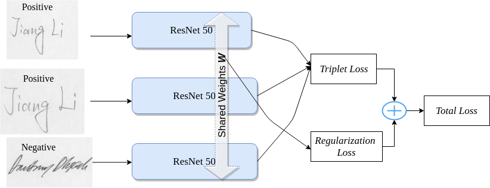

# Tensorflow-Signature-Recognition
A siamese network implementation for signature recognition. A Resnet50 based 
siamese network is trained with triplet loss with the choice of online semi-hard negative
mining or hard negative mining. [[Blog for triplet loss]]() [[Blog for simaese]]()

The network is trained on open-source [dataset]().

